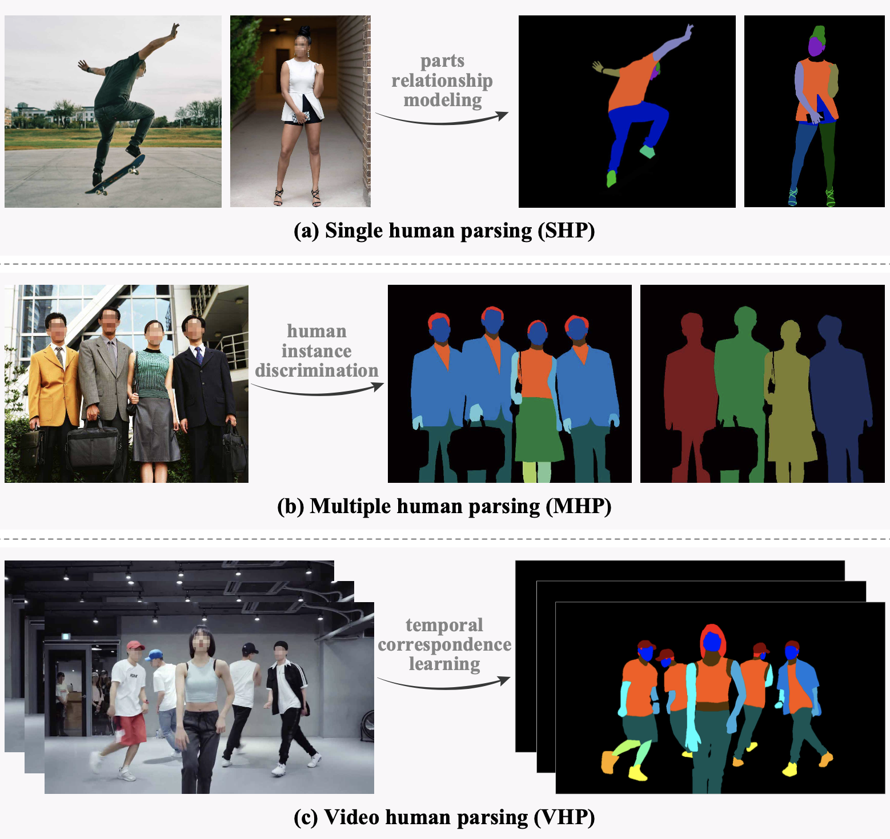
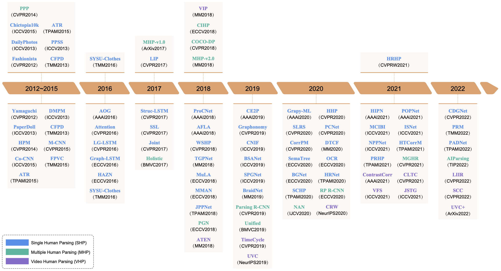
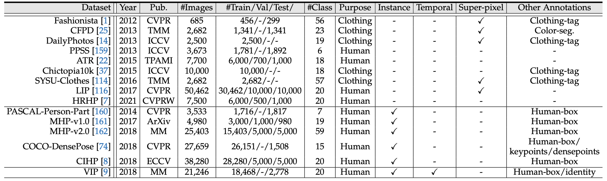

# A Survey of Human-object Interaction Detection with Deep Learning

> [A Survey of Human-object Interaction Detection with Deep Learning]() <br>
> [](https://arxiv.org/pdf/2301.00394.pdf)

If you find this repository helpful, please consider citing:

```BibTeX
@article{yang2023humanparsing,
  title={Deep Learning Technique for Human Parsing: A Survey and Outlook},
  author={Lu Yang and Wenhe Jia and Shan Li and Qing Song},
  journal={arXiv preprint arXiv:2301.00394},
  year={2023}
}
```


## Contributing 

Please feel free to create issues or pull requests to add papers.

## 1. Introduction
Human-object interaction (HOI) detection has attracted significant attention due to its wide applications including human-robot interactions, security monitoring, automatic sports commentary, etc. HOI detection aims to detect humans, objects, and their interactions in a given image or video, so it needs a higher-level semantic understanding of the image than regular object recognition or detection tasks. It is also more challenging technically because of some unique difficulties, such as multiobject interactions and group activities, etc. Currently, deep learning methods have achieved great performance in HOI detection, but there are few reviews describing the recent advance of deep learning-based HOI detection. Moreover, the current stage-based category of HOI detection methods is causing confusion in community discussion and beginner learning. To fill this gap, this paper summarizes, categorizes, and compares HOI detection methods over the last decade. Firstly, we summarize the pipeline of HOI detection methods. Then, we divide existing methods into three categories (Instance feature-based, interaction region-based, and query-based), distinguish them in formulas and schematics, and qualitatively compare their advantages and disadvantages. After that, we review each category of methods in detail. We also quantitatively compare the performance of existing methods on public HOI datasets. At last, we point out the future research direction of HOI detection.

<p align="center"></p>


## 2.  Overview of HOI detection

<p align="center"></p>

- [3.1 Single Human Parsing (SHP) Models](https://github.com/soeaver/awesome-human-parsing/blob/main/3-HP.md#31-Single-Human-Parsing-Models)
- [3.2 Multiple Human Parsing (MHP) Models](https://github.com/soeaver/awesome-human-parsing/blob/main/3-HP.md#32-Multiple-Human-Parsing-Models)
- [3.3 Video Human Parsing (VHP) Models](https://github.com/soeaver/awesome-human-parsing/blob/main/3-HP.md#33-Video-Human-Parsing-Models)

## 6. Dataset, metrics and performance

<p align="center"></p>

- [4.1 Single Human Parsing (SHP) Datasets](https://github.com/soeaver/awesome-human-parsing/blob/main/4-Datasets.md#41-SHP-Datasets)
- [4.2 Multiple Human Parsing (MHP) Datasets](https://github.com/soeaver/awesome-human-parsing/blob/main/4-Datasets.md#42-MHP-Datasets)
- [4.3 Video Human Parsing (VHP) Datasets](https://github.com/soeaver/awesome-human-parsing/blob/main/4-Datasets.md#43-VHP-Datasets)


