# A Survey of Human-object Interaction Detection with Deep Learning

> [A Survey of Human-object Interaction Detection with Deep Learning]() <br>
> []

If you find this repository helpful, please consider citing:

```BibTeX
@article{yang2023humanparsing,
  title={Deep Learning Technique for Human Parsing: A Survey and Outlook},
  author={Lu Yang and Wenhe Jia and Shan Li and Qing Song},
  journal={arXiv preprint arXiv:2301.00394},
  year={2023}
}
```

---
## Contributing 

Compared with the currently published HOI detection review papers, our contributions can be summarized as follows:

(1) We review more than 200 references related to HOI detection and 13 datasets from 2015 to 2024, and compare the advantages and disadvantages of HOI detection methods and datasets. Then we summarize the pipeline of all three classes of HOI detection methods and clearly distinguish them in formulas and schematics.

(2) We analyze the impact of foundation models on HOI detection methods, which is not covered in the previous HOI field review.

(3) Based on the analyzed papers, we reasonably deduce and explore future research directions, analyze the current problems and limitations of each research direction, and propose our suggestions to solve these problems.

---
## Contents

  - [Introduction](#Introduction)
  - [Overview of HOI detection](#Overview-of-HOI-detection)
  - [Two-stage methods](#Two-stage-methods)
  - [One-stage methods](#One-stage-methods)
  - [Transformer-based methods](#Transformer-based-methods)
  - [Foundation models methods](#Foundation-models-methods)
  - [Datasets](#Datasets)
  - [Future directions](#Future-directions)

---
## Introduction
Human-object interaction (HOI) detection has attracted significant attention due to its wide applications, including human-robot interactions, security monitoring, automatic sports commentary, etc. HOI detection aims to detect humans, objects, and their interactions in a given image or video, so it needs a higher-level semantic understanding of the image than regular object recognition or detection tasks. It is also more challenging technically because of some unique difficulties, such as multi-object interactions, long-tail distribution of interaction categories, etc. Currently, deep learning methods have achieved great performance in HOI detection, but there are few reviews describing the recent advance of deep learning-based HOI detection. Moreover, the current stage-based category of HOI detection methods is causing confusion in community discussion and beginner learning. To fill this gap, this paper summarizes, categorizes, and compares methods using deep learning for HOI detection over the last nine years. Firstly, we summarize the pipeline of HOI detection methods. Then, we divide existing methods into three categories (two-stage, one-stage, and transformer-based), distinguish them in formulas and schematics, and qualitatively compare their advantages and disadvantages. After that, we review each category of methods in detail, focusing on HOI detection methods for images. Moreover, we explore the development process of using foundation models for HOI detection. We also quantitatively compare the performance of existing methods on public HOI datasets. At last, we point out the future research direction of HOI detection.

---
## Overview of HOI detection

Deep learning methods have achieved brilliant achievements in object recognition and detection, which greatly reduce manual labor in processing mass visual information. Object recognition aims to answer "What is in the image", while object detection aims to answer "What and where is in the image". However, an expected intelligent machine should have a complete semantics understanding of an scene. Towards this goal, human-object interaction (HOI) detection are proposed to answer ``What are the people doing with what objects?". Fig. 1 gives two examples to show the different goals between object recognition, object detection and HOI detection. From which we can see, HOI detection can provide more human-centered information in the semantics level. Therefore, HOI detection has plenty of application potential in human-robot interactions, security monitoring, automatic sport commentary, action simulation and recognition, etc. At the same time, HOI detection plays a crucial role in the embodied AI system, which thinks that human intelligence needs to be formed through interaction and iteration with actual scenes. 
<p align="center"></p>

However, HOI is a challenging visual task since it not only suffers from the common difficulties of machine vision. It also has to face some unique challenges:

(1) Multi-object interactions. In a complex interaction scene, there may be multiple people performing interactions at the same time, one person interacting with multiple objects, and one object interacting with multiple people, such as a crowded party that involves various objects and interactions. Even if all objects and humans could be detected, assembling them into reasonable HOI triplets is still challenging.

(2) Long-tail distribution of interaction categories. Sample imbalance is particularly serious in HOI datasets. In some datasets, the number of instance samples between different categories is unbalanced. Specifically, the number of common interaction samples can be tens or even hundreds of times that of uncommon interactions. This leads to the unreliable accuracy of the model after training due to overfitting, underfitting, and other problems.

(3) Visual distraction under real-world settings. Visual distraction is serious in HOI detection. In order to detect HOI, the model must identify objects. However, there are many interference factors in the natural environment, including occlusion, deformation, lighting changes, background clutter, shooting perspective, etc. This makes HOI detection challenging.

Existing deep HOI detection methods follow a common four-step pipeline, as shown in Fig.2. Firstly, the model takes an image as the main input. We aim to find out all the HOIs in the image. In addition to visual information, human body model has been used as prior knowledge to improve results. Text corpus has also been used as external clues to detect unseen objects or actions. Secondly, HOI detection methods utilize some off-the-shelf backbone networks to extract features from inputs. For example, ResNet, EfficientNet, ImageNet are used to extract visual features; Hourglass, Openpose are used to estimate the human pose; GloVe, FastText, Word2Vec are used to generate semantic embedding vectors of objects or verbs. Generally, these backbone networks have been pre-trained on large-scale datasets, and their weights are frozen during HOI detection training. An excellent pre-training method can affect the final detection accuracy. Thirdly, the HOI predictor further learns HOI-specific features and then predicts the HOI triplets. The HOI predictor is the core of HOI algorithms, which could be based on various structures, such as CNN, LSTM, GCN, Transformer, etc. Finally, HOI detection model outputs the $\langle$human-verb-object$\rangle$ triplets existed in the image. 
<p align="center">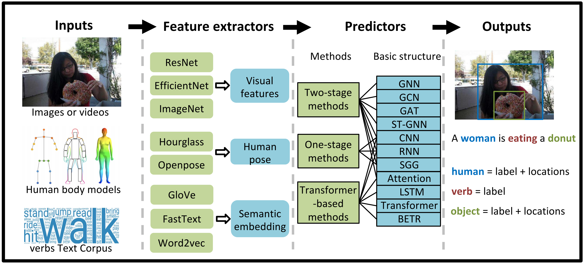</p>

Fig. 3 compares the structural differences among the three categories of methods. Nearly all methods utilize a CNN backbone to extract high-level image features, so Fig. 3 does not show it. Two-stage methods generally follow a sequential structure, while one-stage methods follow a parallel structure. However, some two-stage methods add a net stream to learn features from the global image, which leads to a
hybrid structure. Therefore, we distinguish them by whether they predict an explicit region from the original image to represent the interaction verb or rely on the detected human-object pair to predict the interaction. The transformer-based methods use FFNs to predict HOI triplets based on the latent features extracted by a transformer.
<p align="center">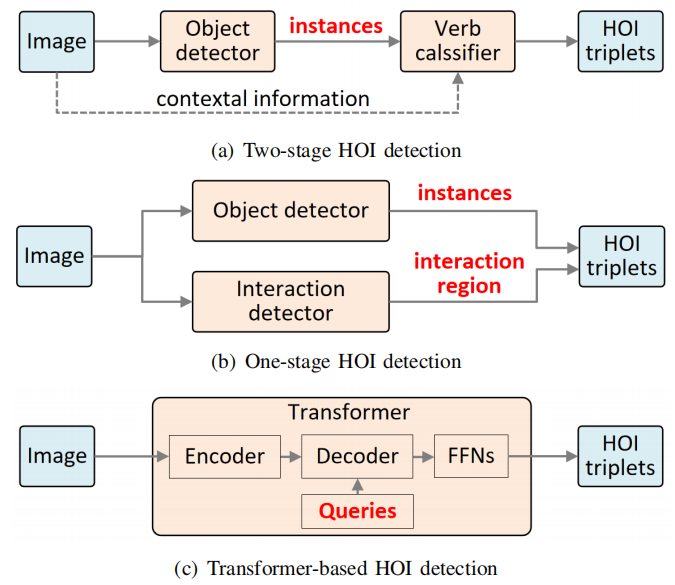</p>

The three types of methods have their own advantages and disadvantages:

(1) Two-stage methods can effectively use the information in the picture, but they have the problem of low time efficiency and high computational complexity. They can effectively use the features of instance and additional information from context, body posture, and other aspects to carry out interaction classification. However, due to the separate architecture, detection algorithms require a lot of time to predict each possible human-object pair individually.

(2) One-stage methods have better time efficiency, but they are difficult to quickly deploy to complex environments. They can detect HOI triples directly from the image due to the one-stage object detector and parallel structure, so they have an obvious improvement in real-time performance. Although the efficiency has been greatly improved, the performance of the existing methods is limited by the complex handcrafted grouping strategies, which makes it difficult to quickly deploy it to complex or special real-world environments.

(3) Transformer-based methods are currently the best method in terms of real-time performance and accuracy, but they lack interpretability. They can apply transformers with a good ability to capture remote dependencies. They can combine the advantages of one-stage methods and transformers to separately predict human-object proposals and interactions with multiple parallel decoders without requiring complex grouping strategies. This makes them the most studied method in the last two years. However, they lack interpretability and cannot easily configure parameters to fine-tune performance.

Fig. 4 the development process of HOI detection methods. For clarity, Fig. 4 only parts but not all existing methods. The listed HOI methods meet the following two conditions: (1) solve a typical HOI detection problem; (2) can be clearly classified into one of the proposed three categories.
<p align="center"></p>

From Fig. 4, we can find the following development trends:

(1) The multi-stream architecture mainly used in the two-stage methods is proposed by HO-RCNN. Later, attention mechanism and graph neural network are introduced into the field of HOI detection, further enriching the diversity of the two-stage methods and the detection accuracy.

(2) The generation of the one-stage methods benefits from the development of the one-stage object detector. PPDM is the first HOI detection method to achieve real-time performance, which has greatly improved the detection efficiency and accuracy compared with other methods in the same period.

(3) For transformer-based methods, DETR is one of the most advanced visual object detection methods. Most of the current transformer-based methods follow the structure of DETR and are further optimized based on DETR to improve the detection effect. At the same time, after the emergence of DETR, since it has greatly improved the real-time performance and accuracy of HOI detection, the two-stage methods and one-stage methods that do not use transformers have been greatly reduced, and many researchers have begun to pay attention to transformer-based methods.

(4) After the large-scale visual language pre-training foundation model CLIP is established, the mainstream research direction to solve the long-tail distribution problem began to shift to CLIP-based HOI detection.

---
## Two-stage methods
Two-stage methods use the appearance of detected instances (either humans or objects) as cues to predict the interaction between them. Therefore, the two-stage methods generally consist of two sequential steps: instance detection and interaction classification. In the first stage, they use an object detector, such as a Faster RCNN, to detect the human and object instances. The output of the first stage includes the labels, bounding box, and in-box features of the detected instances. In the second stage, they use features in the detected box to identify the interaction between each possible human-object pair. Note that the weights of the first-stage detector can be either fixed or updated during training.

The human-object region-based convolutional neural networks (HO-RCNN) proposed by Chao et al. in 2018 is known as the beginning of the two-stage methods. The multi-stream architecture proposed by them is of great significance for HOI detection research. Before the emergence of the transformer, almost all two-stage methods used multi-stream architecture as their structural framework. The multi-stream architecture includes human stream, object stream, and pairwise stream, as shown below. Among them, the human stream and object stream encode the appearance features of humans and objects, respectively, while the purpose of the pairwise stream is to encode the spatial relationship between humans and objects. The model first generates human-object region pair proposals using humans and object detectors. Then, it feeds each human-object pair proposal into a deep neural network (DNN) to generate HOI classification scores, and the scores in the three streams are fused in a later fusion manner. Finally, the interaction classification is performed according to the fusion scores. Due to the outstanding performance of the attention mechanism and GNN in many aspects, such as feature extraction and object detection, researchers have begun to try to incorporate attention and GNN into the structural components of HOI detection, thereby improving detection accuracy.

The process of the two-stage methods divides the HOI detection task into two subtasks: instance detection and interaction classification. Generally, by sorting out relevant literature on HOI detection, we can divide the two-stage methods into two categories based on the model and overall framework of interaction classification: methods based on attention mechanism and methods based on graph neural networks (GNN).

<p align="center">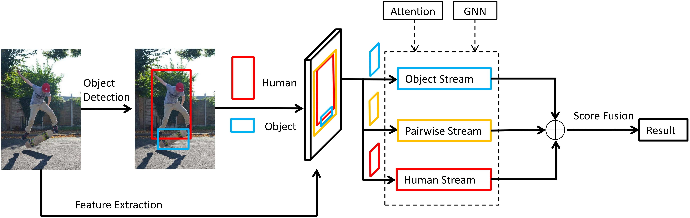</p>
The timeline of two-stage methods is shown below.
<p align="center">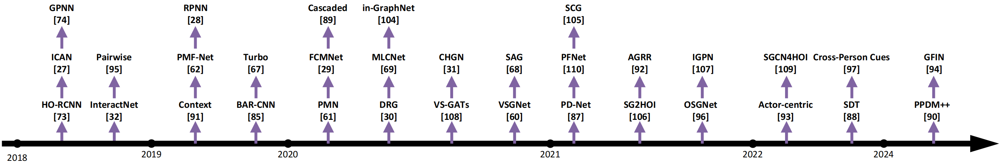</p>
The test results of the two-stage methods on the V-COCO and HICO-DET datasets are presented below.
<p align="center">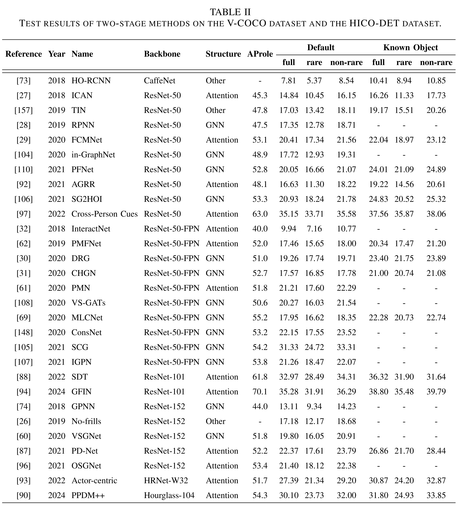</p>
The indexes of all papers in the image are shown below, and the citation numbers at the beginning of the papers are the same as those in the image.

- [73] HO-RCNN:Learning to detect human-object interactions[[Paper]](https://ieeexplore.ieee.org/abstract/document/8354152)
- [27] ICAN:iCAN: Instance-Centric Attention Network for Human-Object Interaction Detection[[Paper]](https://arxiv.org/abs/1808.10437)
- [74] GPNN:Learning human-object interactions by graph parsing neural networks[[Paper]](https://openaccess.thecvf.com/content_ECCV_2018/html/Siyuan_Qi_Learning_Human-Object_Interactions_ECCV_2018_paper.html)
- [32] InteractNet:Detecting and recognizing human-object interactions[[Paper]](https://openaccess.thecvf.com/content_cvpr_2018/html/Gkioxari_Detecting_and_Recognizing_CVPR_2018_paper.html)
- [95] Pairwise:Pairwise body-part attention for recognizing human-object interactions[[Paper]](https://openaccess.thecvf.com/content_ECCV_2018/html/Haoshu_Fang_Pairwise_Body-Part_Attention_ECCV_2018_paper.html)
- [91] Context:Deep contextual attention for human-object interaction detection[[Paper]](https://openaccess.thecvf.com/content_ICCV_2019/html/Wang_Deep_Contextual_Attention_for_Human-Object_Interaction_Detection_ICCV_2019_paper.html)
- [62] PMF-Net:Pose-aware multi-level feature network for human object interaction detection[[Paper]](https://openaccess.thecvf.com/content_ICCV_2019/html/Wan_Pose-Aware_Multi-Level_Feature_Network_for_Human_Object_Interaction_Detection_ICCV_2019_paper.html)
- [28] RPNN:Relation parsing neural network for human-object interaction detection[[Paper]](https://openaccess.thecvf.com/content_ICCV_2019/html/Zhou_Relation_Parsing_Neural_Network_for_Human-Object_Interaction_Detection_ICCV_2019_paper.html)
- [85] BAR-CNN:Detecting visual relationships using box attention[[Paper]](https://openaccess.thecvf.com/content_ICCVW_2019/html/SGRL/Kolesnikov_Detecting_Visual_Relationships_Using_Box_Attention_ICCVW_2019_paper.html?ref=https://githubhelp.com)
- [67] Turbo:Turbo learning framework for human-object interactions recognition and human pose estimation[[Paper]](https://ojs.aaai.org/index.php/AAAI/article/view/3878)
- [61] PMN:Pose-based modular network for human-object interaction detection[[Paper]](https://arxiv.org/abs/2008.02042)
- [29] FCMNet:Amplifying key cues for human-object-interaction detection[[Paper]](https://link.springer.com/chapter/10.1007/978-3-030-58568-6_15)
- [89] Cascaded:Cascaded human-object interaction recognition[[Paper]](https://openaccess.thecvf.com/content_CVPR_2020/html/Zhou_Cascaded_Human-Object_Interaction_Recognition_CVPR_2020_paper.html)
- [30] DRG:DRG: Dual Relation Graph for Human-Object Interaction Detection[[Paper]](https://link.springer.com/chapter/10.1007/978-3-030-58610-2_41)
- [69] MLCNet:Human object interaction detection via multi-level conditioned network[[Paper]](https://dl.acm.org/doi/abs/10.1145/3372278.3390671)
- [104] in-GraphNet:A graph-based interactive reasoning for human-object interaction detection[[Paper]](https://arxiv.org/abs/2007.06925)
- [108] VS-GATs:Visual-semantic graph attention networks for human-object interaction detection[[Paper]](https://ieeexplore.ieee.org/abstract/document/9739429)
- [31] CHGN:Contextual heterogeneous graph network for human-object interaction detection[[Paper]](https://link.springer.com/chapter/10.1007/978-3-030-58520-4_15)
- [60] VSGNet:Vsgnet: Spatial attention network for detecting human object interactions using graph convolutions[[Paper]](https://openaccess.thecvf.com/content_CVPR_2020/html/Ulutan_VSGNet_Spatial_Attention_Network_for_Detecting_Human_Object_Interactions_Using_CVPR_2020_paper.html)
- [68] SAG:Spatio-attentive graphs for human-object interaction detection[[Paper]](https://arxiv.org/pdf/2012.06060v1)
- [87] PD-Net:Polysemy deciphering network for robust human–object interaction detection[[Paper]](https://link.springer.com/article/10.1007/s11263-021-01458-8)
- [110] PFNet:Detecting human—object interaction with multi-level pairwise feature network[[Paper]](https://link.springer.com/article/10.1007/s41095-020-0188-2)
- [105] SCG:Spatially conditioned graphs for detecting human-object interactions[[Paper]](https://openaccess.thecvf.com/content/ICCV2021/html/Zhang_Spatially_Conditioned_Graphs_for_Detecting_Human-Object_Interactions_ICCV_2021_paper.html)
- [106] SG2HOI:Exploiting scene graphs for human-object interaction detection[[Paper]](https://openaccess.thecvf.com/content/ICCV2021/html/He_Exploiting_Scene_Graphs_for_Human-Object_Interaction_Detection_ICCV_2021_paper.html)
- [92] AGRR:Action-guided attention mining and relation reasoning network for human-object interaction detection[[Paper]](https://www.academia.edu/download/97450489/0154.pdf)
- [96] OSGNet:Improved human-object interaction detection through on-the-fly stacked generalization[[Paper]](https://ieeexplore.ieee.org/abstract/document/9360596)
- [107] IGPN:Ipgn:Interactiveness proposal graph network for human-object interaction detection[[Paper]](https://ieeexplore.ieee.org/abstract/document/9489275)
- [93] Actor-centric:Effective actor-centric human-object interaction detection[[Paper]](https://www.sciencedirect.com/science/article/pii/S0262885622000518)
- [109] SGCN4HOI:A skeleton-aware graph convolutional network for human-object interaction detection[[Paper]](https://ieeexplore.ieee.org/abstract/document/9945149)
- [88] SDT:Distance matters in human-object interaction detection[[Paper]](https://dl.acm.org/doi/abs/10.1145/3503161.3547793)
- [97] Cross-Person Cues:Mining cross-person cues for body-part interactiveness learning in hoi detection[[Paper]](https://link.springer.com/chapter/10.1007/978-3-031-19772-7_8)
- [90] PPDM++:Mining cross-person cues for body-part interactiveness learning in hoi detection[[Paper]](https://ieeexplore.ieee.org/abstract/document/10496247)
- [94] GFIN:Human–object interaction detection via global context and pairwise-level fusion features integration[[Paper]](https://www.sciencedirect.com/science/article/pii/S0893608023006251)

---
## One-stage methods
One-stage methods aim to regress a region to represent the interaction. The interaction region could be a point, dynamic points, a union box or multi-scale boxes. In other words, these methods simultaneously detect human instances, object instances, and some interaction areas or points, where the interaction areas are only used to predict interaction verbs.

The common framework of the one-stage methods is shown below. Due to the need to detect humans and objects first and then perform matching and interaction classification, the two-stage methods consume more computing resources and lack flexibility. At the same time, affected by its serial structure, the detection efficiency and real-time performance of the two-stage methods are also flawed. With the development
of one-stage object detectors, scholars have studied more and more one-stage methods. As mentioned above, one-stage methods can reduce HOI detection as a parallel detection problem, detecting HOI triples directly from images. Therefore, compared with the two-stage methods, they have further improved detection efficiency, real-time performance, and accuracy.
<p align="center">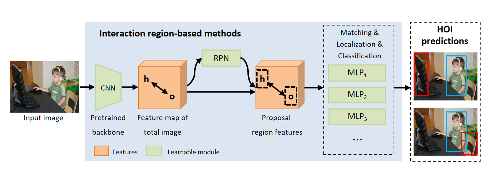</p>
The timeline of one-stage methods is shown below.
<p align="center">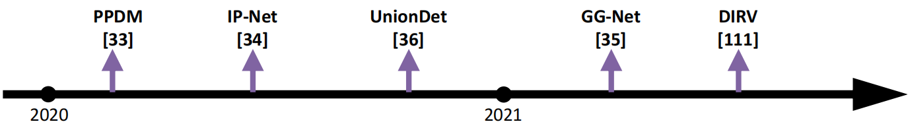</p>
The test results of the one-stage methods on the V-COCO and HICO-DET datasets are presented below.
<p align="center">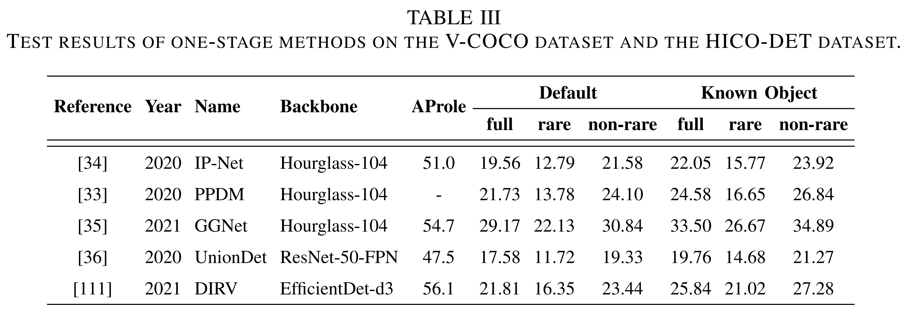</p>
The indexes of all papers in the image are shown below, and the citation numbers at the beginning of the papers are the same as those in the image.

- [33] PPDM:Ppdm: Parallel point detection and matching for real-time human-object interaction detection[[Paper]](https://openaccess.thecvf.com/content_CVPR_2020/html/Liao_PPDM_Parallel_Point_Detection_and_Matching_for_Real-Time_Human-Object_Interaction_CVPR_2020_paper.html)
- [34] IP-Net:Learning human-object interaction detection using interaction points[[Paper]](https://openaccess.thecvf.com/content_CVPR_2020/html/Wang_Learning_Human-Object_Interaction_Detection_Using_Interaction_Points_CVPR_2020_paper.html)
- [36] UnionDet:Uniondet: Union-level detector towards real-time human-object interaction detection[[Paper]](https://link.springer.com/chapter/10.1007/978-3-030-58555-6_30)
- [35] GG-Net:Glance and gaze: Inferring action-aware points for one-stage human-object interaction detection[[Paper]](https://openaccess.thecvf.com/content/CVPR2021/html/Zhong_Glance_and_Gaze_Inferring_Action-Aware_Points_for_One-Stage_Human-Object_Interaction_CVPR_2021_paper.html)
- [111] DIRV:Dirv: Dense interaction region voting for end-to-end human-object interaction detection[[Paper]](https://ojs.aaai.org/index.php/AAAI/article/view/16217)

---
## Transformer-based methods
Transformer-based methods use trainable query vectors to represent HOI triplets. Their basic architecture is a transformer encoder-decoder. The encoder uses an attention mechanism to extract features from the global image context. The decoder takes several learnable query vectors as input, and each query captures at most one interaction action of a human-object pair. Actually, these methods just extend the transformer-based detection model DETR to capture HOI detection and treat HOI detection as a set prediction problem of matching the predicted and ground-truth HOI instances.

The transformer is first proposed as a novel attention model for NLP. It follows an encoder-decoder structure, which takes a sequence as input and generates an output sequence. Either encoder or decoder contains stacked self-attention layers and position-wise feed-forward layers. Since its self-attention layer uses a multi-head attention mechanism to scan through all elements in the input sequence, the transformer can jointly attend to information from the whole sequence. The transformer’s advantages of global computing and perfect memory make it popular in the machine-learning community. 

DETR is one of the most advanced transformer-based visual object detection methods, which views object detection as a direct set prediction problem. It consists of a transformer to generate a set of object predictions and a set-based loss that forces correct matching between predictions and the ground-truth objects. The main advantage of DETR is eliminating the need for many hand-designed components. The tremendous success of DETR has led researchers to investigate its adaptation to HOI detection. For example, HQM can enhance DETR’s robustness and improve detection accuracy by mining hard-positive queries.

At present, most transformer-based HOI methods follow DETR’s pipeline. Their common framework is shown below, which first uses a CNN backbone to extract preliminary visual features from the input image. Then, the 2D feature map is supplemented with a positional encoding and flattened into a 1D sequence. After that, a transformer encoder-decoder architecture further extracts HOI-specific features, where the decoder additionally takes a fixed number of learnable HOI queries as input. Finally, the subsequent feed-forward networks (FFN) process the output of the decoder to generate n HOI prediction results. 

<p align="center">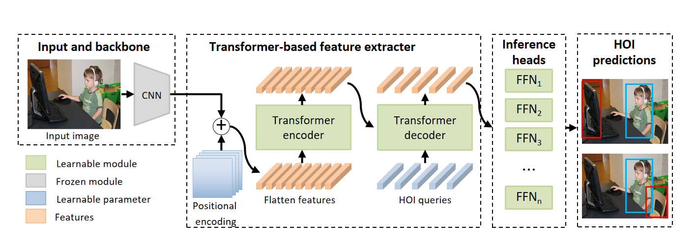</p>

The timeline of transformer-based methods is shown below.
<p align="center">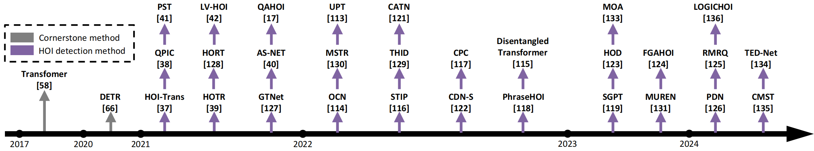</p>
The test results of the transformer-based methods on the V-COCO and HICO-DET datasets are presented below.
<p align="center">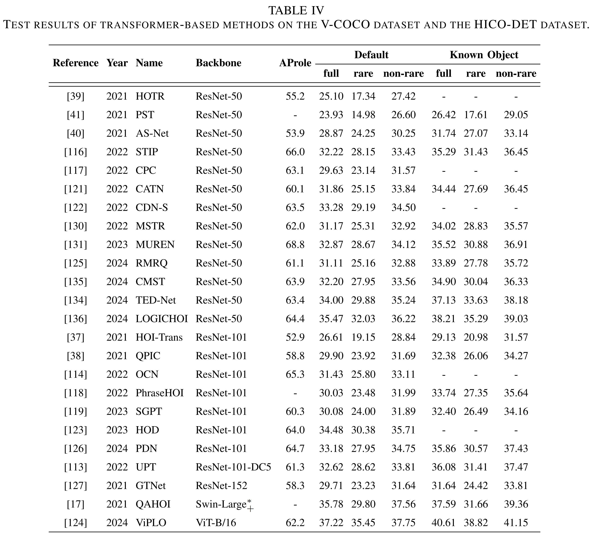</p>
The indexes of all papers in the image are shown below, and the citation numbers at the beginning of the papers are the same as those in the image.

- [37] HOI-Trans:End-to-end human object interaction detection with hoi transformer[[Paper]](https://openaccess.thecvf.com/content/CVPR2021/html/Zou_End-to-End_Human_Object_Interaction_Detection_With_HOI_Transformer_CVPR_2021_paper.html)
- [38] QPIC:Qpic: Query-based pairwise human-object interaction detection with image-wide contextual information[[Paper]](https://openaccess.thecvf.com/content/CVPR2021/html/Tamura_QPIC_Query-Based_Pairwise_Human-Object_Interaction_Detection_With_Image-Wide_Contextual_Information_CVPR_2021_paper.html)
- [41] PST:Visual Relationship Detection Using Part-and-Sum Transformers with Composite Queries[[Paper]](https://openaccess.thecvf.com/content/ICCV2021/html/Dong_Visual_Relationship_Detection_Using_Part-and-Sum_Transformers_With_Composite_Queries_ICCV_2021_paper.html)
- [39] HOTR:Hotr: End-to-end human-object interaction detection with transformers[[Paper]](https://openaccess.thecvf.com/content/CVPR2021/html/Kim_HOTR_End-to-End_Human-Object_Interaction_Detection_With_Transformers_CVPR_2021_paper.html)
- [128] HORT:Detecting human-object relationships in videos[[Paper]](https://openaccess.thecvf.com/content/ICCV2021/html/Ji_Detecting_Human-Object_Relationships_in_Videos_ICCV_2021_paper.html)
- [42] LV-HOI:Discovering human interactions with large-vocabulary objects via query and multi-scale detection[[Paper]](https://openaccess.thecvf.com/content/ICCV2021/html/Wang_Discovering_Human_Interactions_With_Large-Vocabulary_Objects_via_Query_and_Multi-Scale_ICCV_2021_paper.html)
- [127] GTNet:Gtnet: Guided transformer network for detecting human-object interactions[[Paper]](https://www.spiedigitallibrary.org/conference-proceedings-of-spie/12527/125270Q/Gtnet-guided-transformer-network-for-detecting-human-object-interactions/10.1117/12.2663936.short)
- [40] AS-NET:Reformulating hoi detection as adaptive set prediction[[Paper]](https://openaccess.thecvf.com/content/CVPR2021/html/Chen_Reformulating_HOI_Detection_As_Adaptive_Set_Prediction_CVPR_2021_paper.html)
- [17] QAHOI:Qahoi: Query-based anchors for human-object interaction detection[[Paper]](https://ieeexplore.ieee.org/abstract/document/10215534)
- [114] OCN:Detecting human-object interactions with object-guided cross-modal calibrated semantics[[Paper]](https://ojs.aaai.org/index.php/AAAI/article/view/20229)
- [130] MSTR:Mstr: Multi-scale transformer for end-to-end human-object interaction detection[[Paper]](https://openaccess.thecvf.com/content/CVPR2022/html/Kim_MSTR_Multi-Scale_Transformer_for_End-to-End_Human-Object_Interaction_Detection_CVPR_2022_paper.html)
- [113] UPT:Efficient two-stage detection of human-object interactions with a novel unary-pairwise transformer[[Paper]](https://openaccess.thecvf.com/content/CVPR2022/html/Zhang_Efficient_Two-Stage_Detection_of_Human-Object_Interactions_With_a_Novel_Unary-Pairwise_CVPR_2022_paper.html)
- [116] STIP:Exploring structure-aware transformer over interaction proposals for human-object interaction detection[[Paper]](https://openaccess.thecvf.com/content/CVPR2022/html/Zhang_Exploring_Structure-Aware_Transformer_Over_Interaction_Proposals_for_Human-Object_Interaction_Detection_CVPR_2022_paper.html)
- [129] THID:Learning transferable human-object interaction detector with natural language supervision[[Paper]](https://openaccess.thecvf.com/content/CVPR2022/html/Wang_Learning_Transferable_Human-Object_Interaction_Detector_With_Natural_Language_Supervision_CVPR_2022_paper.html)
- [121] CATN:Category-aware transformer network for better human-object interaction detection[[Paper]](https://openaccess.thecvf.com/content/CVPR2022/html/Dong_Category-Aware_Transformer_Network_for_Better_Human-Object_Interaction_Detection_CVPR_2022_paper.html)
- [122] CDN-S:Distillation using oracle queries for transformer-based human-object interaction detection[[Paper]](https://openaccess.thecvf.com/content/CVPR2022/html/Qu_Distillation_Using_Oracle_Queries_for_Transformer-Based_Human-Object_Interaction_Detection_CVPR_2022_paper.html)
- [117] CPC:Consistency learning via decoding path augmentation for transformers in human object interaction detection,[[Paper]](https://openaccess.thecvf.com/content/CVPR2022/html/Park_Consistency_Learning_via_Decoding_Path_Augmentation_for_Transformers_in_Human_CVPR_2022_paper.html)
- [118] PhraseHOI:Improving human-object interaction detection via phrase learning and label composition[[Paper]](https://ojs.aaai.org/index.php/AAAI/article/view/20041)
- [115] Disentangled Transformer:Human-object interaction detection via disentangled transformer[[Paper]](https://openaccess.thecvf.com/content/CVPR2022/html/Zhou_Human-Object_Interaction_Detection_via_Disentangled_Transformer_CVPR_2022_paper.html)
- [119] SGPT:Sgpt: The secondary path guides the primary path in transformers for hoi detection[[Paper]](https://ieeexplore.ieee.org/abstract/document/10160329)
- [123] HOD:Hod: Human-object decoupling network for hoi detection[[Paper]](https://ieeexplore.ieee.org/abstract/document/10219794/)
- [133] MOA:Viplo: Vision transformer based pose-conditioned self-loop graph for human-object interaction detection[[Paper]](https://openaccess.thecvf.com/content/CVPR2023/html/Park_ViPLO_Vision_Transformer_Based_Pose-Conditioned_Self-Loop_Graph_for_Human-Object_Interaction_CVPR_2023_paper.html)
- [131] MUREN:Relational context learning for human-object interaction detection[[Paper]](https://openaccess.thecvf.com/content/CVPR2023/html/Kim_Relational_Context_Learning_for_Human-Object_Interaction_Detection_CVPR_2023_paper.html)
- [124] FGAHOI:Fgahoi: Fine-grained anchors for human-object interaction detection[[Paper]](https://ieeexplore.ieee.org/abstract/document/10315071)
- [126] PDN:Parallel disentangling network for human–object interaction detection[[Paper]](https://www.sciencedirect.com/science/article/pii/S0031320323007185)
- [125] RMRQ:Region mining and refined query improved hoi detection in transformer[[Paper]](https://ieeexplore.ieee.org/abstract/document/10516691/)
- [136] LOGICHOI:Neural-logic human-object interaction detection[[Paper]](https://proceedings.neurips.cc/paper_files/paper/2023/hash/42b7c2f6d320d1fe1afa899a6319d6d7-Abstract-Conference.html)
- [135] CMST:Human-object interaction detection based on cascade multi-scale transformer[[Paper]](https://link.springer.com/article/10.1007/s10489-024-05324-1)
- [134] TED-Net:Ted-net: Dispersal attention for perceiving interaction region in indirectly-contact hoi detection[[Paper]](https://ieeexplore.ieee.org/abstract/document/10415065)

---
## Foundation models methods
The ``Foundation Models" concept is first defined in the article ``On the Opportunities and Risks of Foundation Models" in 2021. Over 200 pages of text, Rishi Bommasani et al. provide a comprehensive introduction to the opportunities and risks of the foundation models, from their capabilities and technical principles to their applications and social impact. Foundation models are defined as an emerging paradigm for building AI systems based on a general class of models. A foundation model generally uses large-scale self-supervision so that it can be adapted to a wide range of downstream tasks. The current examples include BERT, GPT-3 InstructGPT, GPT-4, BLIP-2 and CLIP. The foundation models have multiple capabilities, such as language, vision, reasoning, interaction, and understanding, which shows that they have the potential to change the pattern of existing industries and expand the influence of AI in society.

We introduce the foundation models because, in the past two years, researchers have discovered that the foundation models can be used to solve the long-tail distribution problem in HOI detection. The long-tail distribution problem refers to overfitting, underfitting, and other problems caused by an imbalance in the number of instance samples between different categories in certain datasets. Since 2018, some scholars have begun to notice the seriousness of this problem. 

Before the foundation models methoods appear, most current methods can be divided into three categories:zero-shot/few-shot learning, compositional learning, and weakly-supervised learning. Since the large-scale visual language pre-training foundation model CLIP is proposed in 2021, some studies have gradually focused on CLIP-based HOI detection research.

LLM (large language models) has rich semantic knowledge. It acquires a lot of language knowledge through pre-training and provides text descriptions for HOI detection, which helps to understand the semantics of the interaction. GPT has strong zero-shot and few-shot learning capabilities. It can learn and reason without or with only a small amount of specific data, which is particularly important for solving the long-tail distribution problems. At the same time, GPT also has generative capabilities and can generate natural language descriptions to enhance the understanding of interactions. 

VLM (visual language models), such as BLIP-2 and CLIP, has strong cross-modal learning capabilities and can process visual and language information at the same time. This helps to combine visual features and natural language descriptions in HOI detection, which improves detection accuracy. At the same time, for open vocabulary HOI detection, the VLM model can use natural language descriptions to identify new and unseen interaction relationships, thereby expanding the detection capabilities.

The combination of LLM and VLM can provide richer interpretability and higher accuracy for HOI detection. It can not only intuitively display the interaction relationship, but also perform well in dealing with complex scenes and rare interaction relationships, and is better than the first three methods in dealing with the long-tail distribution problems.

In summary, the foundation model has rich semantic knowledge, strong zero-shot and few-shot learning capabilities, generative capabilities, cross-modal learning capabilities, richer interpretability, and higher accuracy. Observing the timeline of foundation models methods shown below, we can find that after 2022, there are more and more methods using the foundation model to solve long-tail distribution problems, which reflects the impact and potential of the foundation model on HOI detection.

The timeline of foundation models methods is shown below.
<p align="center">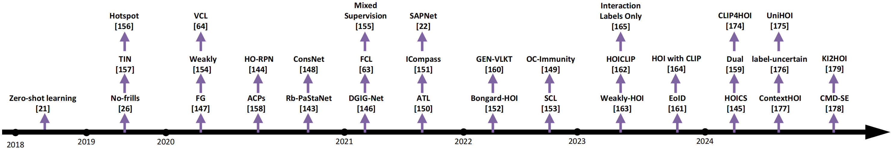</p>
The test results of the foundation model methods on the V-COCO and HICO-DET datasets are presented below.
<p align="center">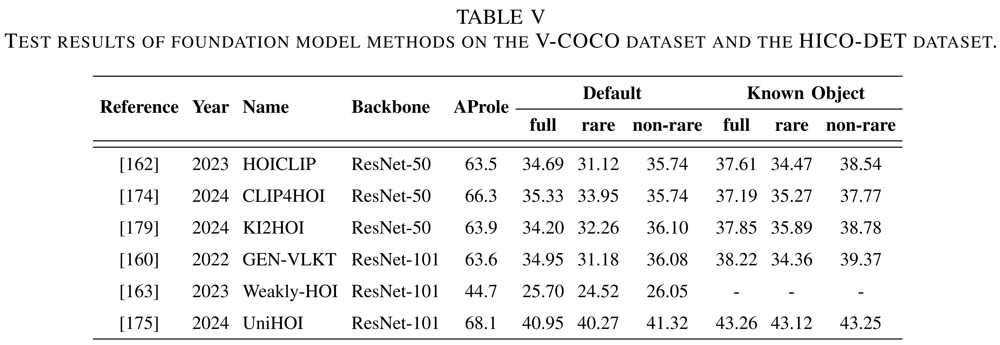</p>
The indexes of all papers in the image are shown below, and the citation numbers at the beginning of the papers are the same as those in the image.

- [21] Zero-shot learning:Scaling human-object interaction recognition through zero-shot learning[[Paper]](https://ieeexplore.ieee.org/document/8354279)
- [26] No-frills:No-frills human-object interaction detection: Factorization, layout encodings, and training techniques[[Paper]](https://openaccess.thecvf.com/content_ICCV_2019/html/Gupta_No-Frills_Human-Object_Interaction_Detection_Factorization_Layout_Encodings_and_Training_Techniques_ICCV_2019_paper.html)
- [157] TIN:Transferable interactiveness knowledge for human-object interaction detection[[Paper]](https://openaccess.thecvf.com/content_CVPR_2019/html/Li_Transferable_Interactiveness_Knowledge_for_Human-Object_Interaction_Detection_CVPR_2019_paper.html)
- [156] Hotspot:Grounded human-object interaction hotspots from video[[Paper]](https://openaccess.thecvf.com/content_ICCV_2019/html/Nagarajan_Grounded_Human-Object_Interaction_Hotspots_From_Video_ICCV_2019_paper.html)
- [147] FG:Detecting human-object interactions via functional generalization[[Paper]](https://ojs.aaai.org/index.php/AAAI/article/view/6616)
- [154] Weakly:Explanation-based weakly-supervised learning of visual relations with graph networks[[Paper]](https://link.springer.com/chapter/10.1007/978-3-030-58604-1_37)
- [64] VCL:Visual compositional learning for human-object interaction detection[[Paper]](https://link.springer.com/chapter/10.1007/978-3-030-58555-6_35)
- [158] ACPs:Detecting human-object interactions with action co-occurrence priors[[Paper]](https://link.springer.com/chapter/10.1007/978-3-030-58589-1_43)
- [144] HO-RPN:Discovering human interactions with novel objects via zero-shot learning[[Paper]](https://openaccess.thecvf.com/content_CVPR_2020/html/Wang_Discovering_Human_Interactions_With_Novel_Objects_via_Zero-Shot_Learning_CVPR_2020_paper.html)
- [143] Rb-PaStaNet:Rb-pastanet: A few-shot human-object interaction detection based on rules and part states[[Paper]](https://arxiv.org/abs/2008.06285)
- [148] ConsNet:Consnet: Learning consistency graph for zero-shot human-object interaction detection[[Paper]](https://dl.acm.org/doi/abs/10.1145/3394171.3413600)
- [146] DGIG-Net:Dgig-net: Dynamic graph-in-graph networks for few-shot human-object interaction[[Paper]](https://ieeexplore.ieee.org/abstract/document/9352497)
- [63] FCL:Detecting human-object interaction via fabricated compositional learning[[Paper]](https://openaccess.thecvf.com/content/CVPR2021/html/Hou_Detecting_Human-Object_Interaction_via_Fabricated_Compositional_Learning_CVPR_2021_paper.html)
- [155] Mixed Supervision:Detecting human-object interaction with mixed supervision[[Paper]](https://openaccess.thecvf.com/content/WACV2021/html/Kumaraswamy_Detecting_Human-Object_Interaction_With_Mixed_Supervision_WACV_2021_paper.html)
- [150] ATL:Affordance transfer learning for human-object interaction detection[[Paper]](https://openaccess.thecvf.com/content/CVPR2021/html/Hou_Affordance_Transfer_Learning_for_Human-Object_Interaction_Detection_CVPR_2021_paper.html)
- [151] ICompass:Interaction compass: Multi-label zero-shot learning of human-object interactions via spatial relations[[Paper]](https://openaccess.thecvf.com/content/ICCV2021/html/Huynh_Interaction_Compass_Multi-Label_Zero-Shot_Learning_of_Human-Object_Interactions_via_Spatial_ICCV_2021_paper.html)
- [122] SAPNet:Distillation using oracle queries for transformer-based human-object interaction detection[[Paper]](https://openaccess.thecvf.com/content/CVPR2022/html/Qu_Distillation_Using_Oracle_Queries_for_Transformer-Based_Human-Object_Interaction_Detection_CVPR_2022_paper.html)
- [152] Bongard-HOI:Bongard-hoi: Benchmarking few-shot visual reasoning for human-object interactions[[Paper]](https://openaccess.thecvf.com/content/CVPR2022/html/Jiang_Bongard-HOI_Benchmarking_Few-Shot_Visual_Reasoning_for_Human-Object_Interactions_CVPR_2022_paper.html)
- [160] GEN-VLKT:Gen-vlkt: Simplify association and enhance interaction understanding for hoi detection[[Paper]](https://openaccess.thecvf.com/content/CVPR2022/html/Liao_GEN-VLKT_Simplify_Association_and_Enhance_Interaction_Understanding_for_HOI_Detection_CVPR_2022_paper.html)
- [153] SCL:Discovering human-object interaction concepts via self-compositional learning[[Paper]](https://link.springer.com/chapter/10.1007/978-3-031-19812-0_27)
- [149] OC-Immunity:Highlighting object category immunity for the generalization of human-object interaction detection[[Paper]](https://ojs.aaai.org/index.php/AAAI/article/view/20075)
- [163] Weakly-HOI:Weakly-supervised hoi detection via prior-guided bi-level representation learning[[Paper]](https://arxiv.org/abs/2303.01313)
- [162] HOICLIP:Hoiclip: Efficient knowledge transfer for hoi detection with vision-language models[[Paper]](https://openaccess.thecvf.com/content/CVPR2023/html/Ning_HOICLIP_Efficient_Knowledge_Transfer_for_HOI_Detection_With_Vision-Language_Models_CVPR_2023_paper.html)
- [165] Interaction Labels Only:Weakly-supervised hoi detection from interaction labels only and language/vision-language priors[[Paper]](https://arxiv.org/abs/2303.05546)
- [161] EoID:End-to-end zero-shot hoi detection via vision and language knowledge distillation[[Paper]](https://ojs.aaai.org/index.php/AAAI/article/view/25385)
- [164] HOI with CLIP:Exploiting clip for zero-shot hoi detection requires knowledge distillation at multiple levels[[Paper]](https://openaccess.thecvf.com/content/WACV2024/html/Wan_Exploiting_CLIP_for_Zero-Shot_HOI_Detection_Requires_Knowledge_Distillation_at_WACV_2024_paper.html)
- [145] HOICS:Hoics: Zero-shot hoi detection via compatibility self-learning[[Paper]](https://ieeexplore.ieee.org/abstract/document/10446999)
- [159] Dual:Dual-prior augmented decoding network for long tail distribution in hoi detection[[Paper]](https://ojs.aaai.org/index.php/AAAI/article/view/27949)
- [174] CLIP4HOI:Clip4hoi: Towards adapting clip for practical zero-shot hoi detection[[Paper]](https://proceedings.neurips.cc/paper_files/paper/2023/hash/8fd5bc08e744fe0dfe798c61d1575a22-Abstract-Conference.html)
- [177] ContextHOI:Contextual human object interaction understanding from pre-trained large language model[[Paper]](https://ieeexplore.ieee.org/abstract/document/10447511)
- [176] label-uncertain:Few-shot learning from augmented label-uncertain queries in bongard-hoi[[Paper]](https://ojs.aaai.org/index.php/AAAI/article/view/28079)
- [175] UniHOI:Detecting any human-object interaction relationship: Universal hoi detector with spatial prompt learning on foundation models[[Paper]](https://proceedings.neurips.cc/paper_files/paper/2023/hash/02687e7b22abc64e651be8da74ec610e-Abstract-Conference.html)
- [178] CMD-SE:Exploring the potential of large foundation models for open-vocabulary hoi detection[[Paper]](https://openaccess.thecvf.com/content/CVPR2024/html/Lei_Exploring_the_Potential_of_Large_Foundation_Models_for_Open-Vocabulary_HOI_CVPR_2024_paper.html)
- [179] KI2HOI:Towards zero-shot human-object interaction detection via vision-language integration[[Paper]](https://arxiv.org/abs/2403.07246)

---
## Dataset
In this section, we summarize the information of popular HOI detection datasets, as shown in table below. From 2015 to 2024, a total of 13 datasets for HOI detection emerged, including HICO, V-COCO, HICO-DET, HCVRD, HOI-A, HAKE, Ambiguous-HOI, HOI-VP, SWiG-HOI, BEHAVE, HAKE-HOI, HOI-SDC, and HOT.

<p align="center">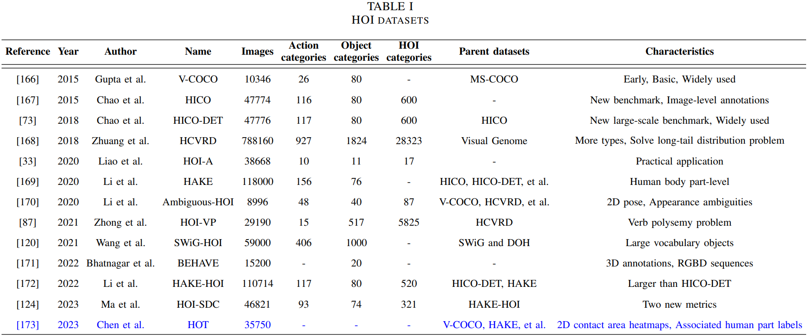</p>


The indexes of all papers in the table are shown below, and the citation numbers at the beginning of the papers are the same as those in the table.

- [166] V-COCO:Visual semantic role labeling[[Paper]](https://arxiv.org/abs/1505.04474)
- [167] HICO:HICO: A Benchmark for Recognizing Human-Object Interactions in Images[[Paper]](https://www.cv-foundation.org/openaccess/content_iccv_2015/html/Chao_HICO_A_Benchmark_ICCV_2015_paper.html)
- [73] HICO-DET:Learning to detect human-object interactions[[Paper]](https://ieeexplore.ieee.org/abstract/document/8354152)
- [168] HCVRD:Hcvrd: A benchmark for large-scale human-centered visual relationship detection[[Paper]](https://ojs.aaai.org/index.php/AAAI/article/view/12260)
- [33] HOI-A:Ppdm: Parallel point detection and matching for real-time human-object interaction detection[[Paper]](https://openaccess.thecvf.com/content_CVPR_2020/html/Liao_PPDM_Parallel_Point_Detection_and_Matching_for_Real-Time_Human-Object_Interaction_CVPR_2020_paper.html)
- [169] HAKE:Hake: Human activity knowledge engine[[Paper]](https://arxiv.org/abs/1904.06539)
- [170] Ambiguous-HOI:Detailed 2d-3d joint representation for human-object interaction[[Paper]](https://openaccess.thecvf.com/content_CVPR_2020/html/Li_Detailed_2D-3D_Joint_Representation_for_Human-Object_Interaction_CVPR_2020_paper.html)
- [87] HOI-VP:Polysemy deciphering network for robust human–object interaction detection[[Paper]](https://link.springer.com/article/10.1007/s11263-021-01458-8)
- [120] SWiG-HOI:Discovering human interactions with large-vocabulary objects via query and multi-scale detection[[Paper]](https://openaccess.thecvf.com/content/ICCV2021/html/Wang_Discovering_Human_Interactions_With_Large-Vocabulary_Objects_via_Query_and_Multi-Scale_ICCV_2021_paper.html)
- [171] BEHAVE:Behave: Dataset and method for tracking human object interactions[[Paper]](https://openaccess.thecvf.com/content/CVPR2022/html/Bhatnagar_BEHAVE_Dataset_and_Method_for_Tracking_Human_Object_Interactions_CVPR_2022_paper.html)
- [172] HAKE-HOI:Transferable interactiveness knowledge for human-object interaction detection[[Paper]](https://arxiv.org/pdf/2101.10292v1)
- [124] HOI-SDC:Fgahoi: Fine-grained anchors for human-object interaction detection[[Paper]](https://ieeexplore.ieee.org/abstract/document/10315071)
- [173] HOT:Detecting human-object contact in images[[Paper]](https://openaccess.thecvf.com/content/CVPR2023/html/Chen_Detecting_Human-Object_Contact_in_Images_CVPR_2023_paper.html)

---
## Future Directions
Deep learning-based HOI detection methods are still in development, and there are many difficulties that need to be explored and solved. Future research can be carried out from the following aspects.

### (1) Domain adaptations for various scenes. 

The future HOI detection algorithm should be both general and professional. Generality refers to the ability to apply models trained on existing data to unseen scenarios. Professional refers to the ability to train models for specific usage scenarios based on existing data. Domain adaptations can effectively reduce the dependence on labeled training data [188, 189]. At present, the most advanced research directions in this area are few-shot and zero-shot learning, both of which are the application of Meta-Learning in the field of supervised learning. The two hope that the machine learning model can quickly learn new categories with only a small number of samples or zero samples. At present, some early work has begun to explore their application value in the field of HOI detection.

### (2) Transformer models are getting increasing attention. 

Transformer’s advantages of global computing and perfect memory make it popular in the machine-learning community. As we mentioned above, the transformer-based methods are slightly more efficient than the one-stage methods in grouping results and interaction classification, and they are also better than the two-stage methods in terms of real-time and accuracy performance. We can find that transformer-based HOI detection methods have become the main research direction in 2024 and they are likely to get more attention in the future. At present, transformer-based methods still face difficulties such as long convergence time, poor interpretability, high computational complexity, weak deployment ability in natural environments, and substantial memory needed for model computation. In the future, further research can be conducted on optimizing decoder computing power, mining more interaction information between human pose and contact environment, extracting features from objects that are too small in images, simplifying configuration parameters and fine-tuning processes, and enhancing real-time application performance and generalization performance.

### (3) Foundation models to solve the long-tail distribution problem. 

Nowadays, the popularity of ChatGPT has caused more and more researchers to focus on the foundation models. In the field of HOI detection, there have been some articles using the foundation models, such as CLIP, GPT, and BLIP-2, to solve the long-tail distribution problem. The foundation models also perform excellently in solving problems such as excessive reliance on a large number of HOI text labels for classification, poor transferability, complex and diverse HOIs in the real world, poor ability to understand contextual information, and weak comprehensive reasoning ability in previous HOI detection methods. It is conceivable that with the further development of foundation models, more researchers will try to use foundation models to optimize existing HOI detection methods. In the future, further research can be conducted through foundation models to generate and capture uncommon interactions in the long-tail distribution problem, enhance the interaction interpretation and language understanding of complex HOIs using prior knowledge, enhance contextual context and zero-shot reasoning ability, and generate human body part state descriptions using the extensive world knowledge.

### (4) More comprehensive and professional datasets. 

The existing mainstream datasets all have room for further optimization. For example, in V-COCO, the number of instance samples between different categories is unbalanced, which will cause long-tail distribution. At the same time, there is also the problem that the interaction categories are not comprehensive. Although the current largest dataset HCVRD has 9852 behavior categories, it still cannot cover the relationship category between all humans and objects. In addition, datasets with more professional characteristics also have research value. Extracting synthetic data from games is also an excellent way to augment the dataset.

### (5) Multi-modal optimizes HOI detection performance. 

In recent years, multi-modal fusion target detection has become a new direction to solve problems such as the poor performance of traditional target detection in complex environments. Similarly, multi-modal fusion can also use information from different modalities to more comprehensively capture interactive information, further improving the robustness, accuracy and versatility of the HOI detection model. In addition to traditional visual information, the available modal information can also be obtained from sensor, radar, LiDAR, sound, 3D pose and mesh reconstruction, etc.

### (6) Beyond HOI detection: HOI generation. 

In the HOI motion generation field, various innovative methods have emerged in recent years. These methods aim to simulate and generate HOI motions that conform to real physical rules and semantic logic based on the characteristics of scenes, text or objects. Combining physical simulation, reinforcement learning, modular design, and deep learning technologies makes the HOI motion generation more natural, accurate, and widely applicable. These research results provide strong support for virtual reality (VR), augmented reality (AR), and human-machine interaction (HMI).

