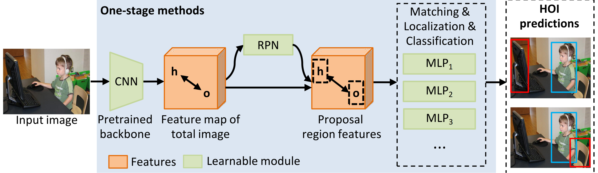

# A Survey of Human-object Interaction Detection with Deep Learning

> [A Survey of Human-object Interaction Detection with Deep Learning]() <br>
> []

If you find this repository helpful, please consider citing:

```BibTeX
@article{yang2023humanparsing,
  title={Deep Learning Technique for Human Parsing: A Survey and Outlook},
  author={Lu Yang and Wenhe Jia and Shan Li and Qing Song},
  journal={arXiv preprint arXiv:2301.00394},
  year={2023}
}
```


## Contributing 

Compared with the currently published HOI detection review papers, our contributions can be summarized as follows:

(1) We review more than 200 references related to HOI detection and 13 datasets from 2015 to 2024, and compare the advantages and disadvantages of HOI detection methods and datasets. Then we summarize the pipeline of all three classes of HOI detection methods and clearly distinguish them in formulas and schematics.

(2) We analyze the impact of foundation models on HOI detection methods, which is not covered in the previous HOI field review.

(3) Based on the analyzed papers, we reasonably deduce and explore future research directions, analyze the current problems and limitations of each research direction, and propose our suggestions to solve these problems.

## 1. Introduction
Human-object interaction (HOI) detection has attracted significant attention due to its wide applications, including human-robot interactions, security monitoring, automatic sports commentary, etc. HOI detection aims to detect humans, objects, and their interactions in a given image or video, so it needs a higher-level semantic understanding of the image than regular object recognition or detection tasks. It is also more challenging technically because of some unique difficulties, such as multi-object interactions, long-tail distribution of interaction categories, etc. Currently, deep learning methods have achieved great performance in HOI detection, but there are few reviews describing the recent advance of deep learning-based HOI detection. Moreover, the current stage-based category of HOI detection methods is causing confusion in community discussion and beginner learning. To fill this gap, this paper summarizes, categorizes, and compares methods using deep learning for HOI detection over the last nine years. Firstly, we summarize the pipeline of HOI detection methods. Then, we divide existing methods into three categories (two-stage, one-stage, and transformer-based), distinguish them in formulas and schematics, and qualitatively compare their advantages and disadvantages. After that, we review each category of methods in detail, focusing on HOI detection methods for images. Moreover, we explore the development process of using foundation models for HOI detection. We also quantitatively compare the performance of existing methods on public HOI datasets. At last, we point out the future research direction of HOI detection.


## 2.  Overview of HOI detection

Deep learning methods have achieved brilliant achievements in object recognition and detection, which greatly reduce manual labor in processing mass visual information. Object recognition aims to answer ``What is in the image", while object detection aims to answer ``What and where is in the image". However, an expected intelligent machine should have a complete semantics understanding of an scene. Towards this goal, human-object interaction (HOI) detection are proposed to answer ``What are the people doing with what objects?". Fig. 1 gives two examples to show the different goals between object recognition, object detection and HOI detection. From which we can see, HOI detection can provide more human-centered information in the semantics level. Therefore, HOI detection has plenty of application potential in human-robot interactions, security monitoring, automatic sport commentary, action simulation and recognition, etc. At the same time, HOI detection plays a crucial role in the embodied AI system, which thinks that human intelligence needs to be formed through interaction and iteration with actual scenes. 
<p align="center"></p>

Existing deep HOI detection methods follow a common four-step pipeline, as shown in Fig.2. Firstly, the model takes an image as the main input. We aim to find out all the HOIs in the image. In addition to visual information, human body model has been used as prior knowledge to improve results. Text corpus has also been used as external clues to detect unseen objects or actions. Secondly, HOI detection methods utilize some off-the-shelf backbone networks to extract features from inputs. For example, ResNet, EfficientNet, ImageNet are used to extract visual features; Hourglass, Openpose are used to estimate the human pose; GloVe, FastText, Word2Vec are used to generate semantic embedding vectors of objects or verbs. Generally, these backbone networks have been pre-trained on large-scale datasets, and their weights are frozen during HOI detection training. An excellent pre-training method can affect the final detection accuracy. Thirdly, the HOI predictor further learns HOI-specific features and then predicts the HOI triplets. The HOI predictor is the core of HOI algorithms, which could be based on various structures, such as CNN, LSTM, GCN, Transformer, etc. Finally, HOI detection model outputs the $\langle$human-verb-object$\rangle$ triplets existed in the image. 
<p align="center"></p>

Fig. 3 compares the structural differences among the three categories of methods. Nearly all methods utilize a CNN backbone to extract high-level image features, so Fig. 3 does not show it. Two-stage methods generally follow a sequential structure, while one-stage methods follow a parallel structure. However, some two-stage methods add a net stream to learn features from the global image, which leads to a
hybrid structure. Therefore, we distinguish them by whether they predict an explicit region from the original image to represent the interaction verb or rely on the detected humanobject pair to predict the interaction. The transformer-based methods use FFNs to predict HOI triplets based on the latent features extracted by a transformer.
<p align="center"></p>

Fig. 4 the development process of HOI detection methods. For clarity, Fig. 4 only parts but not all existing methods. The listed HOI methods meet the following two conditions: (1) solve a typical HOI detection problem; (2) can be clearly classified into one of the proposed three categories.
<p align="center"></p>

## 3. Two-stage methods
Two-stage methods use the appearance of detected instances (either humans or objects) as cues to predict the interaction between them. Therefore, the two-stage methods generally consist of two sequential steps: instance detection and interaction classification. In the first stage, they use an object detector, such as a Faster RCNN, to detect the human and object instances. The output of the first stage includes the labels, bounding box, and in-box features of the detected instances. In the second stage, they use features in the detected box to identify the interaction between each possible human-object pair. Note that the weights of the first-stage detector can be either fixed or updated during training.
<p align="center"></p>
<p align="center"></p>
<p align="center"></p>

- Learning to detect human-object interactions:[73 HO-RCNN](https://ieeexplore.ieee.org/abstract/document/8354152)
- [27 ICAN](https://arxiv.org/abs/1808.10437)
- [74 GPNN](https://openaccess.thecvf.com/content_ECCV_2018/html/Siyuan_Qi_Learning_Human-Object_Interactions_ECCV_2018_paper.html)
- [32 InteractNet](https://openaccess.thecvf.com/content_cvpr_2018/html/Gkioxari_Detecting_and_Recognizing_CVPR_2018_paper.html)
- [95 Pairwise](https://openaccess.thecvf.com/content_ECCV_2018/html/Haoshu_Fang_Pairwise_Body-Part_Attention_ECCV_2018_paper.html)
- [91 Context](https://openaccess.thecvf.com/content_ICCV_2019/html/Wang_Deep_Contextual_Attention_for_Human-Object_Interaction_Detection_ICCV_2019_paper.html)
- [62 PMF-Net](https://openaccess.thecvf.com/content_ICCV_2019/html/Wan_Pose-Aware_Multi-Level_Feature_Network_for_Human_Object_Interaction_Detection_ICCV_2019_paper.html)
- [28 RPNN](https://openaccess.thecvf.com/content_ICCV_2019/html/Zhou_Relation_Parsing_Neural_Network_for_Human-Object_Interaction_Detection_ICCV_2019_paper.html)
- [85 BAR-CNN](https://openaccess.thecvf.com/content_ICCVW_2019/html/SGRL/Kolesnikov_Detecting_Visual_Relationships_Using_Box_Attention_ICCVW_2019_paper.html?ref=https://githubhelp.com)
- [67 Turbo](https://ojs.aaai.org/index.php/AAAI/article/view/3878)
- [61 PMN](https://arxiv.org/abs/2008.02042)
- [29 FCMNet](https://link.springer.com/chapter/10.1007/978-3-030-58568-6_15)
- [89 Cascaded](https://openaccess.thecvf.com/content_CVPR_2020/html/Zhou_Cascaded_Human-Object_Interaction_Recognition_CVPR_2020_paper.html)
- [30 DRG](https://link.springer.com/chapter/10.1007/978-3-030-58610-2_41)
- [69 MLCNet](https://dl.acm.org/doi/abs/10.1145/3372278.3390671)
- [104 in-GraphNet](https://arxiv.org/abs/2007.06925)
- [108 VS-GATs](https://ieeexplore.ieee.org/abstract/document/9739429)
- [31 CHGN](https://link.springer.com/chapter/10.1007/978-3-030-58520-4_15)
- [60 VSGNet](https://openaccess.thecvf.com/content_CVPR_2020/html/Ulutan_VSGNet_Spatial_Attention_Network_for_Detecting_Human_Object_Interactions_Using_CVPR_2020_paper.html)
- [68 SAG](https://arxiv.org/pdf/2012.06060v1)
- [87 PD-Net](https://link.springer.com/article/10.1007/s11263-021-01458-8)
- [110 PFNet](https://link.springer.com/article/10.1007/s41095-020-0188-2)
- [105 SCG](https://openaccess.thecvf.com/content/ICCV2021/html/Zhang_Spatially_Conditioned_Graphs_for_Detecting_Human-Object_Interactions_ICCV_2021_paper.html)
- [106 SG2HOI](https://openaccess.thecvf.com/content/ICCV2021/html/He_Exploiting_Scene_Graphs_for_Human-Object_Interaction_Detection_ICCV_2021_paper.html)
- [92 AGRR](https://www.academia.edu/download/97450489/0154.pdf)
- [96 OSGNet](https://ieeexplore.ieee.org/abstract/document/9360596)
- [107 IGPN](https://ieeexplore.ieee.org/abstract/document/9489275)
- [93 Actor-centric](https://www.sciencedirect.com/science/article/pii/S0262885622000518)
- [109 SGCN4HOI](https://ieeexplore.ieee.org/abstract/document/9945149)
- [88 SDT](https://dl.acm.org/doi/abs/10.1145/3503161.3547793)
- [97 Cross-Person Cues](https://link.springer.com/chapter/10.1007/978-3-031-19772-7_8)
- [90 PPDM++](https://ieeexplore.ieee.org/abstract/document/10496247)
- [94 GFIN](https://www.sciencedirect.com/science/article/pii/S0893608023006251)


## 4. One-stage methods
One-stage methods aim to regress a region to represent the interaction. The interaction region could be a point, dynamic points, a union box or multi-scale boxes. In other words, these methods simultaneously detect human instances, object instances, and some interaction areas or points, where the interaction areas are only used to predict interaction verbs.
<p align="center"></p>
<p align="center"></p>
<p align="center"></p>

- [33 PPDM](https://openaccess.thecvf.com/content_CVPR_2020/html/Liao_PPDM_Parallel_Point_Detection_and_Matching_for_Real-Time_Human-Object_Interaction_CVPR_2020_paper.html)
- [34 IP-Net](https://openaccess.thecvf.com/content_CVPR_2020/html/Wang_Learning_Human-Object_Interaction_Detection_Using_Interaction_Points_CVPR_2020_paper.html)
- [36 UnionDet](https://link.springer.com/chapter/10.1007/978-3-030-58555-6_30)
- [35 GG-Net](https://openaccess.thecvf.com/content/CVPR2021/html/Zhong_Glance_and_Gaze_Inferring_Action-Aware_Points_for_One-Stage_Human-Object_Interaction_CVPR_2021_paper.html)
- [111 DIRV](https://ojs.aaai.org/index.php/AAAI/article/view/16217)

## 5. Transformer-based methods
Transformer-based methods use trainable query vectors to represent HOI triplets. Their basic architecture is a transformer encoder-decoder. The encoder uses an attention mechanism to extract features from the global image context. The decoder takes several learnable query vectors as input, and each query captures at most one interaction action of a human-object pair. Actually, these methods just extend the transformer-based detection model DETR to capture HOI detection and treat HOI detection as a set prediction problem of matching the predicted and ground-truth HOI instances.
<p align="center"></p>
<p align="center"></p>
<p align="center"></p>

- [37 HOI-Trans](https://openaccess.thecvf.com/content/CVPR2021/html/Zou_End-to-End_Human_Object_Interaction_Detection_With_HOI_Transformer_CVPR_2021_paper.html)
- [38 QPIC](https://openaccess.thecvf.com/content/CVPR2021/html/Tamura_QPIC_Query-Based_Pairwise_Human-Object_Interaction_Detection_With_Image-Wide_Contextual_Information_CVPR_2021_paper.html)
- [41 PST](https://openaccess.thecvf.com/content/ICCV2021/html/Dong_Visual_Relationship_Detection_Using_Part-and-Sum_Transformers_With_Composite_Queries_ICCV_2021_paper.html)
- [39 HOTR](https://openaccess.thecvf.com/content/CVPR2021/html/Kim_HOTR_End-to-End_Human-Object_Interaction_Detection_With_Transformers_CVPR_2021_paper.html)
- [128 HORT](https://openaccess.thecvf.com/content/ICCV2021/html/Ji_Detecting_Human-Object_Relationships_in_Videos_ICCV_2021_paper.html)
- [42 LV-HOI](https://openaccess.thecvf.com/content/ICCV2021/html/Wang_Discovering_Human_Interactions_With_Large-Vocabulary_Objects_via_Query_and_Multi-Scale_ICCV_2021_paper.html)
- [127 GTNet](https://www.spiedigitallibrary.org/conference-proceedings-of-spie/12527/125270Q/Gtnet-guided-transformer-network-for-detecting-human-object-interactions/10.1117/12.2663936.short)
- [40 AS-NET](https://openaccess.thecvf.com/content/CVPR2021/html/Chen_Reformulating_HOI_Detection_As_Adaptive_Set_Prediction_CVPR_2021_paper.html)
- [17 QAHOI](https://ieeexplore.ieee.org/abstract/document/10215534)
- [114 OCN](https://ojs.aaai.org/index.php/AAAI/article/view/20229)
- [130 MSTR](https://openaccess.thecvf.com/content/CVPR2022/html/Kim_MSTR_Multi-Scale_Transformer_for_End-to-End_Human-Object_Interaction_Detection_CVPR_2022_paper.html)
- [113 UPT](https://openaccess.thecvf.com/content/CVPR2022/html/Zhang_Efficient_Two-Stage_Detection_of_Human-Object_Interactions_With_a_Novel_Unary-Pairwise_CVPR_2022_paper.html)
- [116 STIP](https://openaccess.thecvf.com/content/CVPR2022/html/Zhang_Exploring_Structure-Aware_Transformer_Over_Interaction_Proposals_for_Human-Object_Interaction_Detection_CVPR_2022_paper.html)
- [129 THID](https://openaccess.thecvf.com/content/CVPR2022/html/Wang_Learning_Transferable_Human-Object_Interaction_Detector_With_Natural_Language_Supervision_CVPR_2022_paper.html)
- [121 CATN](https://openaccess.thecvf.com/content/CVPR2022/html/Dong_Category-Aware_Transformer_Network_for_Better_Human-Object_Interaction_Detection_CVPR_2022_paper.html)
- [122 CDN-S](https://openaccess.thecvf.com/content/CVPR2022/html/Qu_Distillation_Using_Oracle_Queries_for_Transformer-Based_Human-Object_Interaction_Detection_CVPR_2022_paper.html)
- [117 CPC](https://openaccess.thecvf.com/content/CVPR2022/html/Park_Consistency_Learning_via_Decoding_Path_Augmentation_for_Transformers_in_Human_CVPR_2022_paper.html)
- [118 PhraseHOI](https://ojs.aaai.org/index.php/AAAI/article/view/20041)
- [115 Disentangled Transformer](https://openaccess.thecvf.com/content/CVPR2022/html/Zhou_Human-Object_Interaction_Detection_via_Disentangled_Transformer_CVPR_2022_paper.html)
- [119 SGPT](https://ieeexplore.ieee.org/abstract/document/10160329)
- [123 HOD](https://ieeexplore.ieee.org/abstract/document/10219794/)
- [133 MOA](https://openaccess.thecvf.com/content/CVPR2023/html/Park_ViPLO_Vision_Transformer_Based_Pose-Conditioned_Self-Loop_Graph_for_Human-Object_Interaction_CVPR_2023_paper.html)
- [131 MUREN](https://openaccess.thecvf.com/content/CVPR2023/html/Kim_Relational_Context_Learning_for_Human-Object_Interaction_Detection_CVPR_2023_paper.html)
- [124 FGAHOI](https://ieeexplore.ieee.org/abstract/document/10315071)
- [126 PDN](https://www.sciencedirect.com/science/article/pii/S0031320323007185)
- [125 RMRQ](https://ieeexplore.ieee.org/abstract/document/10516691/)
- [136 LOGICHOI](https://proceedings.neurips.cc/paper_files/paper/2023/hash/42b7c2f6d320d1fe1afa899a6319d6d7-Abstract-Conference.html)
- [135 CMST](https://link.springer.com/article/10.1007/s10489-024-05324-1)
- [134 TED-Net](https://ieeexplore.ieee.org/abstract/document/10415065)

## 6. Foundation models methods
The ``Foundation Models" concept is first defined in the article ``On the Opportunities and Risks of Foundation Models" in 2021. Over 200 pages of text, Rishi Bommasani et al. provide a comprehensive introduction to the opportunities and risks of the foundation models, from their capabilities and technical principles to their applications and social impact. Foundation models are defined as an emerging paradigm for building AI systems based on a general class of models. A foundation model generally uses large-scale self-supervision so that it can be adapted to a wide range of downstream tasks. The current examples include BERT, GPT-3 InstructGPT, GPT-4, BLIP-2 and CLIP. The foundation models have multiple capabilities, such as language, vision, reasoning, interaction, and understanding, which shows that they have the potential to change the pattern of existing industries and expand the influence of AI in society.
We introduce the foundation models because, in the past two years, researchers have discovered that the foundation models can be used to solve the long-tail distribution problem in HOI detection. The long-tail distribution problem refers to overfitting, underfitting, and other problems caused by an imbalance in the number of instance samples between different categories in certain datasets. Since 2018, some scholars have begun to notice the seriousness of this problem.
<p align="center"></p>
<p align="center"></p>

- [21 Zero-shot learning](https://ieeexplore.ieee.org/document/8354279)
- [26 No-frills](https://openaccess.thecvf.com/content_ICCV_2019/html/Gupta_No-Frills_Human-Object_Interaction_Detection_Factorization_Layout_Encodings_and_Training_Techniques_ICCV_2019_paper.html)
- [157 TIN](https://openaccess.thecvf.com/content_CVPR_2019/html/Li_Transferable_Interactiveness_Knowledge_for_Human-Object_Interaction_Detection_CVPR_2019_paper.html)
- [156 Hotspot](https://openaccess.thecvf.com/content_ICCV_2019/html/Nagarajan_Grounded_Human-Object_Interaction_Hotspots_From_Video_ICCV_2019_paper.html)
- [147 FG](https://ojs.aaai.org/index.php/AAAI/article/view/6616)
- [154 Weakly](https://link.springer.com/chapter/10.1007/978-3-030-58604-1_37)
- [64 VCL](https://link.springer.com/chapter/10.1007/978-3-030-58555-6_35)
- [158 ACPs](https://link.springer.com/chapter/10.1007/978-3-030-58589-1_43)
- [144 HO-RPN](https://openaccess.thecvf.com/content_CVPR_2020/html/Wang_Discovering_Human_Interactions_With_Novel_Objects_via_Zero-Shot_Learning_CVPR_2020_paper.html)
- [143 Rb-PaStaNet](https://arxiv.org/abs/2008.06285)
- [148 ConsNet](https://dl.acm.org/doi/abs/10.1145/3394171.3413600)
- [146 DGIG-Net](https://ieeexplore.ieee.org/abstract/document/9352497)
- [63 FCL](https://openaccess.thecvf.com/content/CVPR2021/html/Hou_Detecting_Human-Object_Interaction_via_Fabricated_Compositional_Learning_CVPR_2021_paper.html)
- [155 Mixed Supervision](https://openaccess.thecvf.com/content/WACV2021/html/Kumaraswamy_Detecting_Human-Object_Interaction_With_Mixed_Supervision_WACV_2021_paper.html)
- [150 ATL](https://openaccess.thecvf.com/content/CVPR2021/html/Hou_Affordance_Transfer_Learning_for_Human-Object_Interaction_Detection_CVPR_2021_paper.html)
- [151 ICompass](https://openaccess.thecvf.com/content/ICCV2021/html/Huynh_Interaction_Compass_Multi-Label_Zero-Shot_Learning_of_Human-Object_Interactions_via_Spatial_ICCV_2021_paper.html)
- [122 SAPNet](https://openaccess.thecvf.com/content/CVPR2022/html/Qu_Distillation_Using_Oracle_Queries_for_Transformer-Based_Human-Object_Interaction_Detection_CVPR_2022_paper.html)
- [152 Bongard-HOI](https://openaccess.thecvf.com/content/CVPR2022/html/Jiang_Bongard-HOI_Benchmarking_Few-Shot_Visual_Reasoning_for_Human-Object_Interactions_CVPR_2022_paper.html)
- [160 GEN-VLKT](https://openaccess.thecvf.com/content/CVPR2022/html/Liao_GEN-VLKT_Simplify_Association_and_Enhance_Interaction_Understanding_for_HOI_Detection_CVPR_2022_paper.html)
- [153 SCL](https://link.springer.com/chapter/10.1007/978-3-031-19812-0_27)
- [149 OC-Immunity](https://ojs.aaai.org/index.php/AAAI/article/view/20075)
- [163 Weakly-HOI](https://arxiv.org/abs/2303.01313)
- [162 HOICLIP](https://openaccess.thecvf.com/content/CVPR2023/html/Ning_HOICLIP_Efficient_Knowledge_Transfer_for_HOI_Detection_With_Vision-Language_Models_CVPR_2023_paper.html)
- [165 Interaction Labels Only](https://arxiv.org/abs/2303.05546)
- [161 EoID](https://ojs.aaai.org/index.php/AAAI/article/view/25385)
- [164 HOI with CLIP](https://openaccess.thecvf.com/content/WACV2024/html/Wan_Exploiting_CLIP_for_Zero-Shot_HOI_Detection_Requires_Knowledge_Distillation_at_WACV_2024_paper.html)
- [145 HOICS](https://ieeexplore.ieee.org/abstract/document/10446999)
- [159 Dual](https://ojs.aaai.org/index.php/AAAI/article/view/27949)
- [174 CLIP4HOI](https://proceedings.neurips.cc/paper_files/paper/2023/hash/8fd5bc08e744fe0dfe798c61d1575a22-Abstract-Conference.html)
- [177 ContextHOI](https://ieeexplore.ieee.org/abstract/document/10447511)
- [176 label-uncertain](https://ojs.aaai.org/index.php/AAAI/article/view/28079)
- [175 UniHOI](https://proceedings.neurips.cc/paper_files/paper/2023/hash/02687e7b22abc64e651be8da74ec610e-Abstract-Conference.html)
- [178 CMD-SE](https://openaccess.thecvf.com/content/CVPR2024/html/Lei_Exploring_the_Potential_of_Large_Foundation_Models_for_Open-Vocabulary_HOI_CVPR_2024_paper.html)
- [179 KI2HOI](https://arxiv.org/abs/2403.07246)

## 7. Dataset
In this section, we summarize the information of popular HOI detection datasets. From 2015 to 2024, a total of 13 datasets for HOI detection emerged, including HICO, V-COCO, HICO-DET, HCVRD, HOI-A, HAKE, Ambiguous-HOI, HOI-VP, SWiG-HOI, BEHAVE, HAKE-HOI, HOI-SDC, and HOT.
<p align="center"></p>


- [166 V-COCO](https://arxiv.org/abs/1505.04474)
- [167 HICO](https://www.cv-foundation.org/openaccess/content_iccv_2015/html/Chao_HICO_A_Benchmark_ICCV_2015_paper.html)
- [73 HICO-DET](https://ieeexplore.ieee.org/abstract/document/8354152)
- [168 HCVRD](https://ojs.aaai.org/index.php/AAAI/article/view/12260)
- [33 HOI-A](https://openaccess.thecvf.com/content_CVPR_2020/html/Liao_PPDM_Parallel_Point_Detection_and_Matching_for_Real-Time_Human-Object_Interaction_CVPR_2020_paper.html)
- [169 HAKE](https://arxiv.org/abs/1904.06539)
- [170 Ambiguous-HOI](https://openaccess.thecvf.com/content_CVPR_2020/html/Li_Detailed_2D-3D_Joint_Representation_for_Human-Object_Interaction_CVPR_2020_paper.html)
- [87 HOI-VP](https://link.springer.com/article/10.1007/s11263-021-01458-8)
- [120 SWiG-HOI](https://openaccess.thecvf.com/content/ICCV2021/html/Wang_Discovering_Human_Interactions_With_Large-Vocabulary_Objects_via_Query_and_Multi-Scale_ICCV_2021_paper.html)
- [171 BEHAVE](https://openaccess.thecvf.com/content/CVPR2022/html/Bhatnagar_BEHAVE_Dataset_and_Method_for_Tracking_Human_Object_Interactions_CVPR_2022_paper.html)
- [172 HAKE-HOI](https://arxiv.org/pdf/2101.10292v1)
- [124 HOI-SDC](https://ieeexplore.ieee.org/abstract/document/10315071)
- [173 HOT](https://openaccess.thecvf.com/content/CVPR2023/html/Chen_Detecting_Human-Object_Contact_in_Images_CVPR_2023_paper.html)


