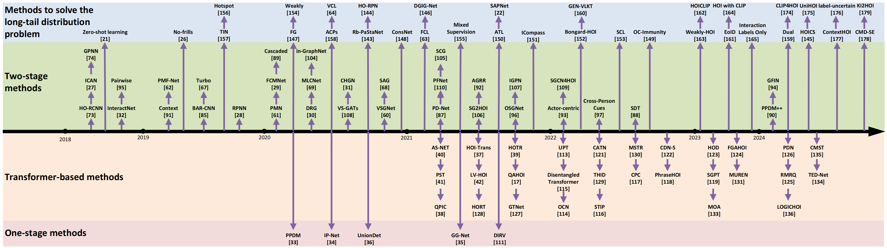
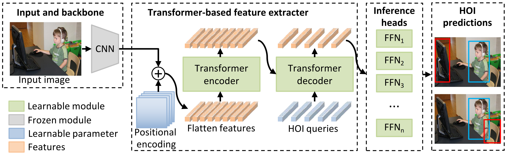

# A Survey of Human-object Interaction Detection with Deep Learning

> [A Survey of Human-object Interaction Detection with Deep Learning]() <br>
> [](https://arxiv.org/pdf/2301.00394.pdf)

If you find this repository helpful, please consider citing:

```BibTeX
@article{yang2023humanparsing,
  title={Deep Learning Technique for Human Parsing: A Survey and Outlook},
  author={Lu Yang and Wenhe Jia and Shan Li and Qing Song},
  journal={arXiv preprint arXiv:2301.00394},
  year={2023}
}
```


## Contributing 

Please feel free to create issues or pull requests to add papers.

## 1. Introduction
Human-object interaction (HOI) detection has attracted significant attention due to its wide applications, including human-robot interactions, security monitoring, automatic sports commentary, etc. HOI detection aims to detect humans, objects, and their interactions in a given image or video, so it needs a higher-level semantic understanding of the image than regular object recognition or detection tasks. It is also more challenging technically because of some unique difficulties, such as multi-object interactions, long-tail distribution of interaction categories, etc. Currently, deep learning methods have achieved great performance in HOI detection, but there are few reviews describing the recent advance of deep learning-based HOI detection. Moreover, the current stage-based category of HOI detection methods is causing confusion in community discussion and beginner learning. To fill this gap, this paper summarizes, categorizes, and compares methods using deep learning for HOI detection over the last nine years. Firstly, we summarize the pipeline of HOI detection methods. Then, we divide existing methods into three categories (two-stage, one-stage, and transformer-based), distinguish them in formulas and schematics, and qualitatively compare their advantages and disadvantages. After that, we review each category of methods in detail, focusing on HOI detection methods for images. Moreover, we explore the development process of using foundation models for HOI detection. We also quantitatively compare the performance of existing methods on public HOI datasets. At last, we point out the future research direction of HOI detection.


## 2.  Overview of HOI detection

Deep learning methods have achieved brilliant achievements in object recognition and detection, which greatly reduce manual labor in processing mass visual information. Object recognition aims to answer ``What is in the image", while object detection aims to answer ``What and where is in the image". However, an expected intelligent machine should have a complete semantics understanding of an scene. Towards this goal, human-object interaction (HOI) detection are proposed to answer ``What are the people doing with what objects?". Fig. 1 gives two examples to show the different goals between object recognition, object detection and HOI detection. From which we can see, HOI detection can provide more human-centered information in the semantics level. Therefore, HOI detection has plenty of application potential in human-robot interactions, security monitoring, automatic sport commentary, action simulation and recognition, etc. At the same time, HOI detection plays a crucial role in the embodied AI system, which thinks that human intelligence needs to be formed through interaction and iteration with actual scenes. 
<p align="center"></p>

Existing deep HOI detection methods follow a common four-step pipeline, as shown in Fig.2. Firstly, the model takes an image as the main input. We aim to find out all the HOIs in the image. In addition to visual information, human body model has been used as prior knowledge to improve results. Text corpus has also been used as external clues to detect unseen objects or actions. Secondly, HOI detection methods utilize some off-the-shelf backbone networks to extract features from inputs. For example, ResNet, EfficientNet, ImageNet are used to extract visual features; Hourglass, Openpose are used to estimate the human pose; GloVe, FastText, Word2Vec are used to generate semantic embedding vectors of objects or verbs. Generally, these backbone networks have been pre-trained on large-scale datasets, and their weights are frozen during HOI detection training. An excellent pre-training method can affect the final detection accuracy. Thirdly, the HOI predictor further learns HOI-specific features and then predicts the HOI triplets. The HOI predictor is the core of HOI algorithms, which could be based on various structures, such as CNN, LSTM, GCN, Transformer, etc. Finally, HOI detection model outputs the $\langle$human-verb-object$\rangle$ triplets existed in the image. 
<p align="center"></p>

Fig. 3 the development process of HOI detection methods. For clarity, Fig. 3 only parts but not all existing methods. The listed HOI methods meet the following two conditions: (1) solve a typical HOI detection problem; (2) can be clearly classified into one of the proposed three categories.
<p align="center"></p>

## 3. Two-stage methods
Two-stage methods use the appearance of detected instances (either humans or objects) as cues to predict the interaction between them. Therefore, the two-stage methods generally consist of two sequential steps: instance detection and interaction classification. In the first stage, they use an object detector, such as a Faster RCNN, to detect the human and object instances. The output of the first stage includes the labels, bounding box, and in-box features of the detected instances. In the second stage, they use features in the detected box to identify the interaction between each possible human-object pair. Note that the weights of the first-stage detector can be either fixed or updated during training.
<p align="center"></p>
<p align="center"></p>
<p align="center"></p>

- [3.1 Single Human Parsing (SHP) Models](https://github.com/soeaver/awesome-human-parsing/blob/main/3-HP.md#31-Single-Human-Parsing-Models)
- [3.2 Multiple Human Parsing (MHP) Models](https://github.com/soeaver/awesome-human-parsing/blob/main/3-HP.md#32-Multiple-Human-Parsing-Models)
- [3.3 Video Human Parsing (VHP) Models](https://github.com/soeaver/awesome-human-parsing/blob/main/3-HP.md#33-Video-Human-Parsing-Models)

## 4. One-stage methods
One-stage methods aim to regress a region to represent the interaction. The interaction region could be a point, dynamic points, a union box or multi-scale boxes. In other words, these methods simultaneously detect human instances, object instances, and some interaction areas or points, where the interaction areas are only used to predict interaction verbs.
<p align="center"></p>
<p align="center"></p>
<p align="center"></p>

- [4.1 Single Human Parsing (SHP) Models](https://github.com/soeaver/awesome-human-parsing/blob/main/3-HP.md#31-Single-Human-Parsing-Models)
- [3.2 Multiple Human Parsing (MHP) Models](https://github.com/soeaver/awesome-human-parsing/blob/main/3-HP.md#32-Multiple-Human-Parsing-Models)
- [3.3 Video Human Parsing (VHP) Models](https://github.com/soeaver/awesome-human-parsing/blob/main/3-HP.md#33-Video-Human-Parsing-Models)

## 5. Transformer-based methods
Transformer-based methods use trainable query vectors to represent HOI triplets. Their basic architecture is a transformer encoder-decoder. The encoder uses an attention mechanism to extract features from the global image context. The decoder takes several learnable query vectors as input, and each query captures at most one interaction action of a human-object pair. Actually, these methods just extend the transformer-based detection model DETR to capture HOI detection and treat HOI detection as a set prediction problem of matching the predicted and ground-truth HOI instances.
<p align="center"></p>
<p align="center"></p>
<p align="center"></p>

- [3.1 Single Human Parsing (SHP) Models](https://github.com/soeaver/awesome-human-parsing/blob/main/3-HP.md#31-Single-Human-Parsing-Models)
- [3.2 Multiple Human Parsing (MHP) Models](https://github.com/soeaver/awesome-human-parsing/blob/main/3-HP.md#32-Multiple-Human-Parsing-Models)
- [3.3 Video Human Parsing (VHP) Models](https://github.com/soeaver/awesome-human-parsing/blob/main/3-HP.md#33-Video-Human-Parsing-Models)

## 6. Foundation models methods
The ``Foundation Models" concept is first defined in the article ``On the Opportunities and Risks of Foundation Models" in 2021. Over 200 pages of text, Rishi Bommasani et al. provide a comprehensive introduction to the opportunities and risks of the foundation models, from their capabilities and technical principles to their applications and social impact. Foundation models are defined as an emerging paradigm for building AI systems based on a general class of models. A foundation model generally uses large-scale self-supervision so that it can be adapted to a wide range of downstream tasks. The current examples include BERT, GPT-3 InstructGPT, GPT-4, BLIP-2 and CLIP. The foundation models have multiple capabilities, such as language, vision, reasoning, interaction, and understanding, which shows that they have the potential to change the pattern of existing industries and expand the influence of AI in society.
We introduce the foundation models because, in the past two years, researchers have discovered that the foundation models can be used to solve the long-tail distribution problem in HOI detection. The long-tail distribution problem refers to overfitting, underfitting, and other problems caused by an imbalance in the number of instance samples between different categories in certain datasets. Since 2018, some scholars have begun to notice the seriousness of this problem.
<p align="center"></p>
<p align="center"></p>

- [3.1 Single Human Parsing (SHP) Models](https://github.com/soeaver/awesome-human-parsing/blob/main/3-HP.md#31-Single-Human-Parsing-Models)
- [3.2 Multiple Human Parsing (MHP) Models](https://github.com/soeaver/awesome-human-parsing/blob/main/3-HP.md#32-Multiple-Human-Parsing-Models)
- [3.3 Video Human Parsing (VHP) Models](https://github.com/soeaver/awesome-human-parsing/blob/main/3-HP.md#33-Video-Human-Parsing-Models)

## 7. Dataset, metrics and performance
In this section, we summarize the information of popular HOI detection datasets. From 2015 to 2024, a total of 13 datasets for HOI detection emerged, including HICO, V-COCO, HICO-DET, HCVRD, HOI-A, HAKE, Ambiguous-HOI, HOI-VP, SWiG-HOI, BEHAVE, HAKE-HOI, HOI-SDC, and HOT.
<p align="center"></p>


- [V-COCO](http://host.robots.ox.ac.uk:8080/leaderboard/displaylb_noeq.php?challengeid=11&compid=10.6)
- [HICO](http://www.umich.edu/∼ywchao/hico/)
- [HICO-DET](http://www.umich.edu/∼ywchao/hico/)
- [HCVRD](https://github.com/soeaver/awesome-human-parsing/blob/main/3-HP.md#33-Video-Human-Parsing-Models)
- [HOI-A](https://github.com/soeaver/awesome-human-parsing/blob/main/3-HP.md#33-Video-Human-Parsing-Models)
- [HAKE](http://www.umich.edu/∼ywchao/hico/)
- [Ambiguous-HOI](https://github.com/soeaver/awesome-human-parsing/blob/main/3-HP.md#33-Video-Human-Parsing-Models)
- [MECCANO](https://github.com/soeaver/awesome-human-parsing/blob/main/3-HP.md#33-Video-Human-Parsing-Models)
- [HOI-VP](https://github.com/soeaver/awesome-human-parsing/blob/main/3-HP.md#33-Video-Human-Parsing-Models)
- [VidHOI](https://github.com/soeaver/awesome-human-parsing/blob/main/3-HP.md#33-Video-Human-Parsing-Models)
- [V-HICO](https://github.com/soeaver/awesome-human-parsing/blob/main/3-HP.md#33-Video-Human-Parsing-Models)
- [SWiG-HOI](https://github.com/soeaver/awesome-human-parsing/blob/main/3-HP.md#33-Video-Human-Parsing-Models)
- [D3D-HOI](https://github.com/soeaver/awesome-human-parsing/blob/main/3-HP.md#33-Video-Human-Parsing-Models)
- [BEHAVE](https://github.com/soeaver/awesome-human-parsing/blob/main/3-HP.md#33-Video-Human-Parsing-Models)
- [HOI4D](https://github.com/soeaver/awesome-human-parsing/blob/main/3-HP.md#33-Video-Human-Parsing-Models)


